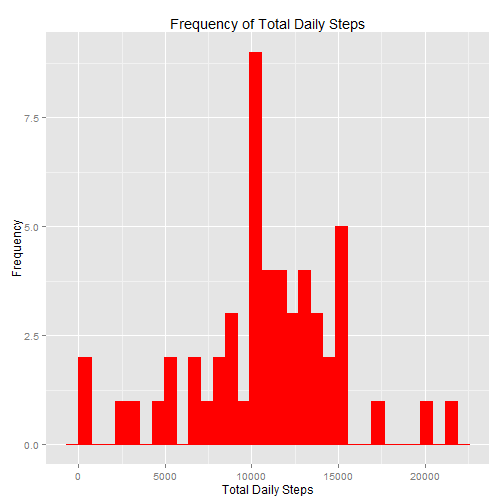
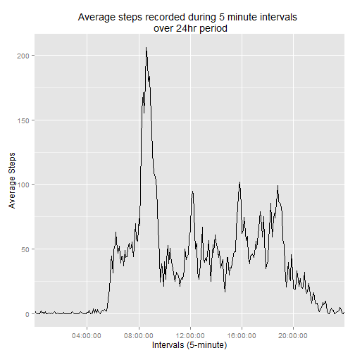
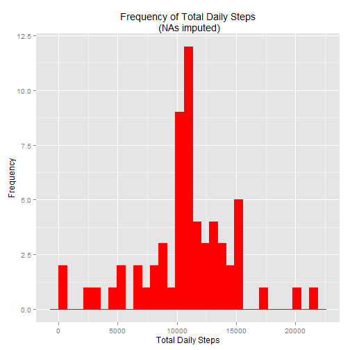
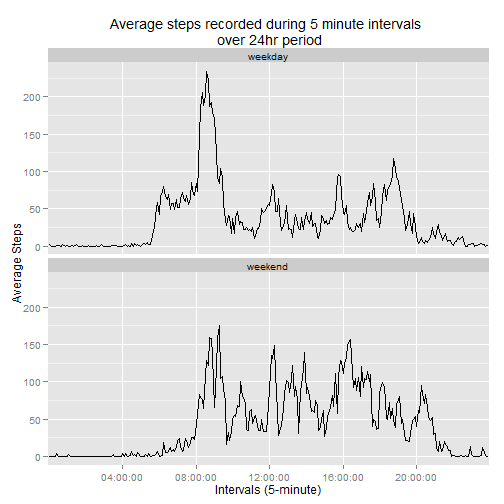

*"This assignment makes use of data from a personal activity monitoring device. This device collects data at 5 minute intervals through out the day. The data consists of two months of data from an anonymous individual collected during the months of October and November, 2012 and include the number of steps taken in 5 minute intervals each day." (R Peng, Assignment Instructions)*

### Loading and preprocessing the data

GENERAL INTRODUCTORY DESCRIPTION:
This code script takes one raw data set (activity.csv); transforms the data
set into a tidy, usable form; imputes NAs and produces a series of plots.

The data set can be downloaded from:
<https://d396qusza40orc.cloudfront.net/repdata%2Fdata%2Factivity.zip>

DESCRIPTION OF THE DATA: 
(after R Peng, Assignment instructions)
"The variables included in this dataset are:  
- steps: Number of steps taking in a 5-minute interval (missing values are 
  coded as NA)  
- date: The date on which the measurement was taken in YYYY-MM-DD format  
- interval: Identifier for the 5-minute interval in which measurement was
  taken  
The dataset is stored in a comma-separated-value (CSV) file and there are a 
total of 17,568 observations in this dataset."

**All files must be in the working directory.**


```r
# Package dependencies:
 library(dplyr)
 library(ggplot2)
 library(stringr)

# getwd()
  setwd("D:/Zoe/R/DS_5")
# list.files()

  activity <- read.csv("./activity.csv")
# dim(activity) # [1] 17568     3  
# str(activity)                           
# activity # Check data
# head(activity)

# Keep copy of original data in original format.
# activityBk <- activity

# Transform interval code into real time.
  activity$time <- str_pad(activity$interval, 4, pad = "0")
  activity$time <- paste(str_sub(activity$time, 1, 2)
                         , str_sub(activity$time, 3, 4)
                         , "00",   sep = ":")
```


### What is mean total number of steps taken per day?


```r
# Calculate total daily steps
  byDate <- group_by(activity, date) 
  totals <- summarise(byDate
                    , totalSteps = sum(steps))

# Plot histogram of total daily steps
  qplot(totalSteps
        , data = totals
        , main = "Frequency of Total Daily Steps"
        , ylab = "Frequency" 
        , xlab = "Total Daily Steps"
        , ) + geom_histogram(colour="red", fill="red")
```

 

The **mean** total number of steps taken each day is:

```r
  mean(totals$totalSteps, na.rm = TRUE)
```

```
## [1] 10766.19
```


The **median** total number of steps taken each day is:

```r
  median(totals$totalSteps, na.rm = TRUE)
```

```
## [1] 10765
```


### What is the average daily activity pattern?


```r
# Create a time series plot of the 5-minute interval and avg number
# of steps, averaged across all days.

byInterval <- group_by(activity, time)
  intervals <- summarise(byInterval
                         , avgSteps = mean(steps, na.rm = TRUE))

  ggplot(data = intervals, aes(x = time, y = avgSteps, group = 1)) + 
    geom_line() +
    scale_x_discrete(breaks=c("04:00:00", "08:00:00", "12:00:00", "16:00:00"
                            , "20:00:00")) + 
    xlab("Intervals (5-minute)") + 
    ylab("Average Steps") +
    ggtitle("Average steps recorded during 5 minute intervals \n over 24hr period")
```

 

Averaged across all days - which 5 minute interval contains the maximum number
of steps?


```r
  intervals%>%
    filter(avgSteps == max(avgSteps))
```

```
## Source: local data frame [1 x 2]
## 
##       time avgSteps
## 1 08:35:00 206.1698
```


### Imputing missing values
There are a number of missing values in the data.


```r
# Calculate total number of rows in data set containing missing values.
  activity %>%
    filter(is.na(steps))%>%
    nrow()
```

```
## [1] 2304
```


Create a new dataset which replaces the missing value with the mean for the interval.


```r
# Fill in all the missing step values with the mean for that interval.

  complete <- inner_join(activity, intervals) 

  complete <- complete %>%
    mutate(newSteps = ifelse(is.na(steps), avgSteps, steps))
```

Plot a histogram with the new dataset.


```r
# Make a histogram of the total number of steps taken each day
# Essentially repeat section 2 with "complete" as starting point

  byDate <- group_by(complete, date)
  totals <- summarise(byDate
                      , totalSteps = sum(newSteps))

  qplot(totalSteps
        , data = totals
        , main = "Frequency of Total Daily Steps\n (NAs imputed)"
        , ylab = "Frequency" 
        , xlab = "Total Daily Steps"
        , ) + geom_histogram(colour="red", fill="red")
```

```
## stat_bin: binwidth defaulted to range/30. Use 'binwidth = x' to adjust this.
## stat_bin: binwidth defaulted to range/30. Use 'binwidth = x' to adjust this.
```

 

The **mean** total number of steps taken each day is:

```r
  mean(totals$totalSteps, na.rm = TRUE)
```

```
## [1] 10766.19
```

This is the *same* as the mean reported from the dataset containing missing values.

The **median** total number of steps taken each day is:

```r
  median(totals$totalSteps, na.rm = TRUE)
```

```
## [1] 10766.19
```

This is *slightly different* from the median reported from the dataset containing missing values.

Overall, imputing the missing values has little effect on the estimates of the total number of daily steps.


### Are there differences in activity patterns between weekdays and weekends?
Create a new factor variable in the dataset with two levels -- "weekday" and "weekend" indicating whether a given date is a weekday or weekend day.

```r
# Create a new factor variable with two levels - "weekday" and "weekend".
  complete$date <- as.Date(complete$date)

  complete <- complete %>%
    mutate(wkday = weekdays(date))

  complete$day <- factor(ifelse(complete$wkday == "Saturday" | 
                                  complete$wkday == "Sunday", 
                                  c("weekend"), c("weekday"))) 
```

Make a panel plot containing a time series plot of the 5-minute interval (x-axis) and the average number of steps taken, averaged across all weekday days or weekend days (y-axis).


```r
  byInterval <- group_by(complete, day, time)
  intervals <- summarise(byInterval
                         , avgSteps = mean(steps, na.rm = TRUE))

  ggplot(data = intervals, aes(x = time, y = avgSteps, group = 1)) + 
    facet_wrap(~day, ncol=1) +
    geom_line() +
    scale_x_discrete(breaks=c("04:00:00", "08:00:00", "12:00:00", "16:00:00"
                              , "20:00:00")) + 
    xlab("Intervals (5-minute)") + 
    ylab("Average Steps") +
    ggtitle("Average steps recorded during 5 minute intervals \n over 24hr period")
```

 
